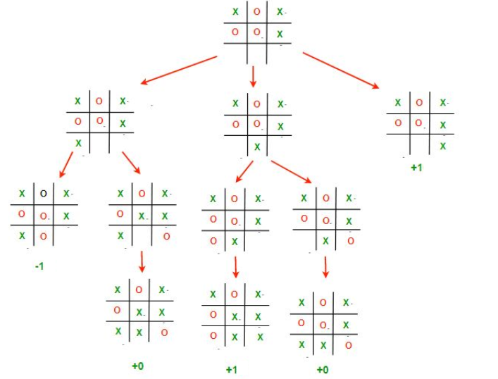
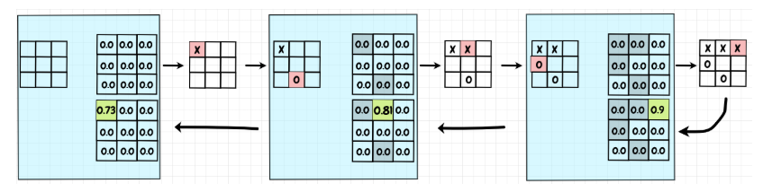
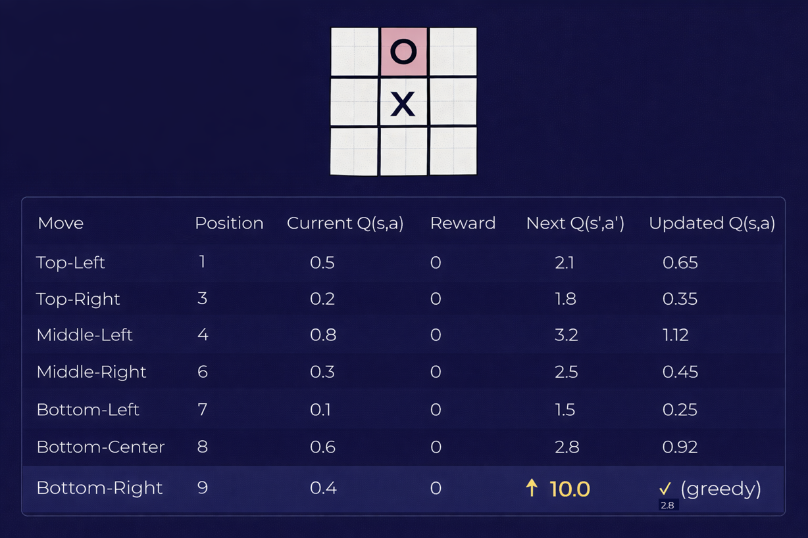

# Reinforcement Learning (RL) — Tic Tac Toe ❌ ⭕

# Introduction

## 1️⃣ What Reinforcement Learning even is?

Reinforcement Learning is a way to teach a computer **by experience**, not by rules

Think about a kid learning a game:

* The kid tries something
* The kid sees if it was good or bad
* The kid remembers what worked
* Next time, the kid tries to do better

That kid is called the **agent**

## 2️⃣ Our game: Tic Tac Toe

The rules (simple life rules):

* 3x3 board
* Two players: ❌ and ⭕
* First to align 3 in a row (horizontal, vertical, diagonal) wins
* If the board fills with no winner → Draw

The agent plays against an opponent

## 3️⃣ Who is the agent?

The **agent** is the learner

In our case:

* The agent chooses one empty square
* The environment updates the board and returns a result

Possible results:

* Win → good 😄
* Lose → bad 😢
* Draw → meh 😐
* Or game continues

## 4️⃣ Rewards (how the agent feels)

We convert feelings into numbers (computers love numbers)

* Win  → +1
* Draw →  0
* Lose → -1
* Non-terminal move → 0

This number is called the **reward**

## 5️⃣ What is a Q-table? (the heart of RL)

Q-table = the agent's **cheat sheet / memory**

It answers this question:

👉 "If I am in this board state and I place my mark in this square, how good is it?"

For Tic Tac Toe, the table is larger than Rock Paper Scissors

States = board configurations
Actions = which empty square I choose

Example (conceptual, not code):

Board state S:

❌ ⭕ ❌  
⭕ ❌ ⬜  
⬜ ⭕ ⬜  

Possible actions:

* Place at (2,0) → value 0.4
* Place at (2,2) → value 0.9
* Place at (1,2) → value 0.1

Higher number = better idea

## 6️⃣ How the Q-table is updated 
## Monte Carlo

## QLearning Score

After each move:

1. Agent picks an action
2. Game gives a reward (if terminal)
3. Agent updates ONE number in the Q-table

Simple idea:

"Was this better or worse than I expected?"

Slow brain formula (no math panic):

new value = old value + small correction

That correction depends on reward and future hope

# Flow and Strategy

## 7️⃣ Gamma (γ) — thinking about the future

Gamma answers:

👉 "Do I care about future rewards or only NOW?"

* Gamma close to 0

  * I only care about this move
  * Greedy mindset

* Gamma close to 1

  * I care about winning in the long run
  * Strategy brain 🧠

Typical value: **0.9**

## 8️⃣ Epsilon (ε) — curiosity vs confidence

Epsilon answers:

👉 "Should I try something random?"

* High epsilon (like 1.0)

  * Try random moves
  * Exploration phase 🧪

* Low epsilon (like 0.1)

  * Use what I already know
  * Exploitation phase 🎯

Training usually looks like:

* Start with high epsilon
* Slowly reduce it

## 9️⃣ Full learning loop (slow recap)

1. Agent looks at Q-table
2. Agent maybe explores (epsilon)
3. Agent chooses a square
4. Game returns reward (if terminal)
5. Q-table is updated
6. Score is updated
7. Repeat MANY games

## Summary 🧠

* Agent = learner
* Reward = feedback
* Q-table = memory
* Gamma = future thinking
* Epsilon = curiosity

Reinforcement Learning is literally:

> Try → Fail → Remember → Improve
