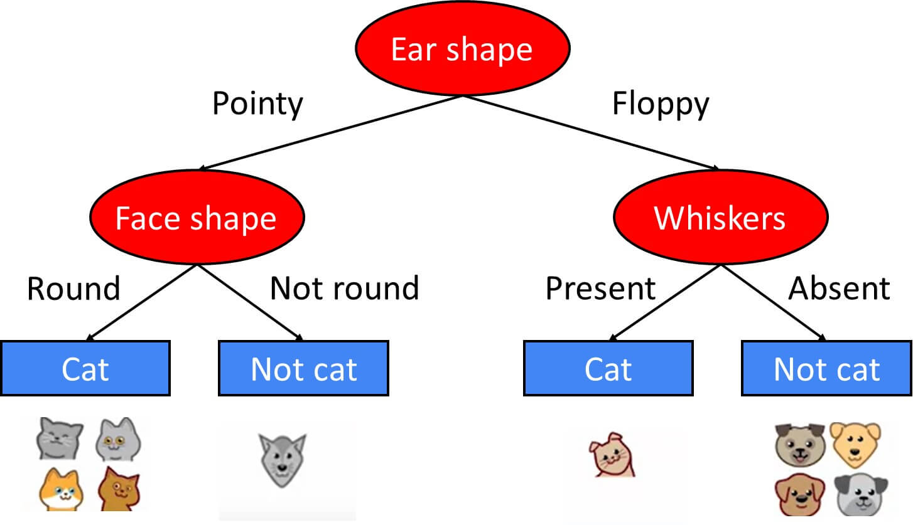

# Decision Tree Classification – Animals



<br />

Use a **Decision Tree Classifier** to predict whether an animal is a **cat**, **dog**, or **horse** based on its **size** and **weight**

## Tasks 

1. Use the provided dataset (`X` and `y`)
2. Perform **three** train/test splits:

   * 80% / 20%
   * 70% / 30%
   * 60% / 40%
3. For each split:

   * Train a `DecisionTreeClassifier`
   * Predict on the test set
   * Print accuracy
   * Print confusion matrix
   * Print tree rules using `export_text`  

4. Compare how the different split ratios affect the results   
5. Predict the animal type with features `[34, 17]` Use the trained model to **predict its class**

**Demo code:**  
https://github.com/pythonai200425/27.11.2025/blob/main/dec_2.ipynb

## Sample Code

```python
from sklearn.tree import DecisionTreeClassifier, export_text
from sklearn.metrics import accuracy_score, confusion_matrix
from sklearn.model_selection import train_test_split
import numpy as np

X = np.array([
    [20, 4], [22, 5], [25, 6],
    [30, 10], [32, 12], [35, 14],
    [40, 18], [45, 20], [48, 22],
    [52, 25], [55, 28], [60, 30],
    [62, 32], [65, 35], [70, 40],
    [30, 10], [45, 20], [60, 30],
    [18, 3], [21, 4], [24, 5],
    [28, 9], [33, 11], [36, 15],
    [25, 6], [55, 28], [40, 18],
    [68, 38], [72, 42], [66, 36]
])

y = np.array([
    "cat", "cat", "cat",
    "dog", "dog", "dog",
    "dog", "dog", "dog",
    "horse", "horse", "horse",
    "horse", "horse", "horse",
    "cat", "horse", "dog",
    "cat", "cat", "cat",
    "dog", "dog", "dog",
    "dog", "dog", "horse",
    "horse", "horse", "horse"
])

# train_test_split

# train (fit)

# predict 

# accuracy 
# cm 

rules = export_text(clf, feature_names=["Size", "Weight"])
print(rules)
```


יש לשלוח את הפתרון למייל:
📧 [pythonai200425+dechw1@gmail.com](mailto:pythonai200425+dechw1@gmail.com)