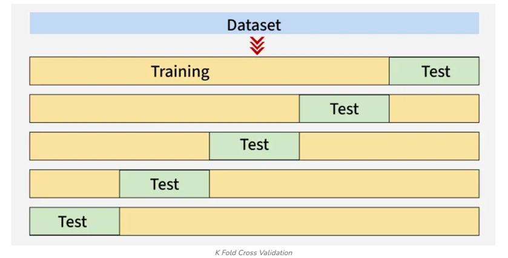

# אופטימיזציה של מודלים

### Cross-Validation (אימות צולב)



אימות צולב מחלק את הנתונים למספר "קיפולים" (folds), ומבצע אימון וניבוי על כל קיפול, ממצע את התוצאות כדי לקבל הערכה מדויקת יותר של ביצועי המודל:

```python
from sklearn.model_selection import cross_val_score

# בדיקת ביצועים עם אימות צולב עבור ערכי K שונים
k_range = range(1, 31)
cv_scores = []

for k in k_range:
    model = KNeighborsClassifier(n_neighbors=k)
    scores = cross_val_score(model, X, y, cv=10, scoring='accuracy')  # 10-fold CV
    # accuracy = (TP + TN) / (TP + TN + FP + FN)
    cv_scores.append(scores.mean())

# הצגת התוצאות בגרף
plt.figure(figsize=(10, 6))
plt.plot(k_range, cv_scores, marker='o')
plt.title('KNN: CV Accuracy for different K values')
plt.xlabel('K Value')
plt.ylabel('CV Accuracy')
plt.xticks(k_range[::2])
plt.grid(True)
plt.show()

# מציאת ערך K האופטימלי
optimal_k_cv = k_range[np.argmax(cv_scores)]
print(f"ערך K האופטימלי (CV) הוא: {optimal_k_cv} עם דיוק ממוצע של: {max(cv_scores):.4f}")
```


